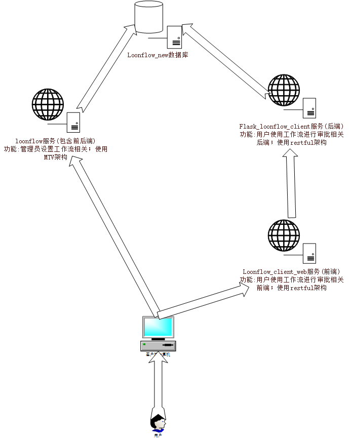

# loonflow_client_web
loonflow项目客户端 工作流审核 前端代码部分

# 声明
此web端项目为 [loonflow(工作流)](https://github.com/blackholll/loonflow) 的客户端项目([shutongFlow](https://github.com/youshutong2080/shutongFlow)) 的前端代码部分;
感谢 前人的辛苦开源，让我们拥有美好的明天!

### 源项目 获取时的最后上传时间为 2019.11.17

# 修改原因
由于shutongFlow项目后端使用Django编写,及在测试 请假申请 时,发现 shutongFlow项目数据库和 loonFlow项目数据库 账号体系不对应，导致审核出现各种问题；

# 修改内容
前端 在签名验证时 取消了 jwt 解密功能;修改文件路径为:./src/store/index.js 27行-34行
如果出现 在登录成功后，页面不执行 api/v1/service/workflows/ 接口,可能原因为前端设置的token有效期已过期,请修改 ./src/store/index.js 33行代码(时间戳大于现在)

# 配合的后端项目为
flask_loonflow_client

# 启动项目方法
cd xxx/loonflow_client_web
npm install .
npm run dev

### 其他相关readme内容,请查看 [shutongFlow](https://github.com/youshutong2080/shutongFlow)

# 项目依赖关系架构图
 
